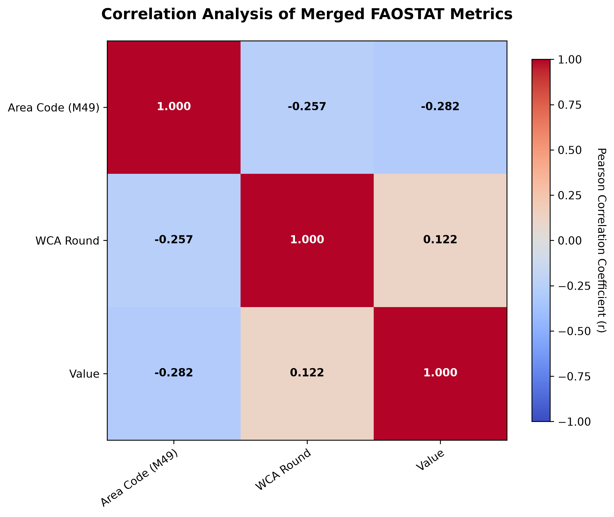
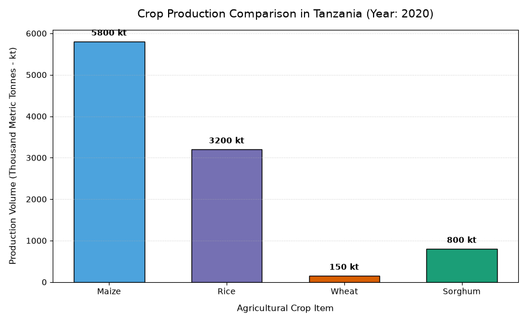
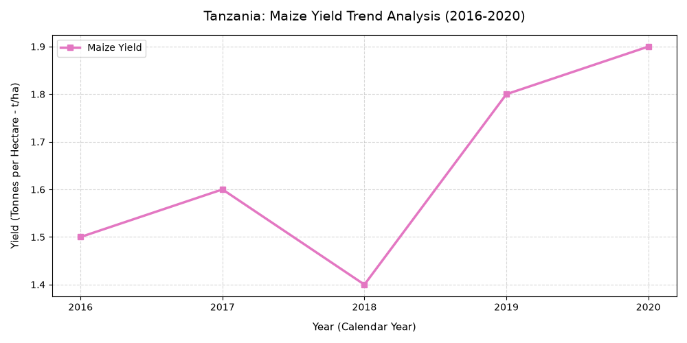

# TITLE : CROP PRODUCTION THROUGH IRRIGATION IN TANZANIA

- **Author:** Mwakubo Abdallah Mussa
- **Registration Number:** IWR/D/2024/0020
- **Course:** AGE 219:Basic of Computer Programing

## 1.PROBLEM STATEMENT

Irrigation in crops production is essential to ensure the food is available within the country.As engineers we must ensure irrigation is performed effectively to increase production.

## 2.DATA SOURCE
- I obtained my data from "fao.org/faostat" on crop production through irrigation.

## 3.METHODOLOGY
### 3.1 Data processing 
- Read 10+ CSV files
- Merged into one named 'merged_faostat_data.csv'
-Cleaned data of Merged files to remove missing values and duplicates
### 3.2 Data analysis
- **Numpy:** Used to create and manipulate N-dimensional arrays. It replaces slow Python loops with fast, vectorized math operations for linear algebra and data reshaping.
- **Scipy:** Used for complex engineering algorithms. It handles numerical integration, non-linear optimization, signal processing, and advanced statistical tests.

## 4. RESULT & CONCLUSION 
### 4.1 Results Visualizations of graphs
- CorrelationMatrix(Correlation plot)

- Figure2(Bar graph)

- Figure3(Trend analysis plot)

### 4.2 Conclusion
- I have gain knowledge on coding and I will this knowledge to solve problems to better engineer.

---

**@kadefue** - This project is submitted for grading AGE 219 as per requirements of assignment of Capstone Project.

